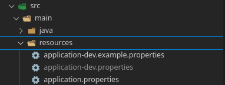
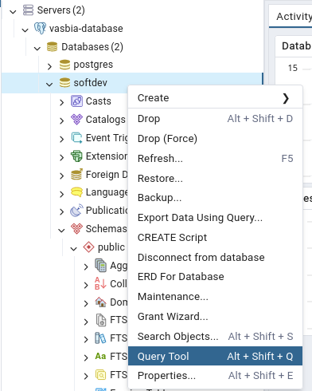

# How to install Vasbia Backend and Database
---
## requirement
- Docker (any version)
- OpenJDK version >= 17 

create `.env` and `src/main/resources/application-dev.properties`


```sh
git clone https://github.com/Vasbia/softdev-api.git

### don't forgot to create env and application-dev.properties file

docker compose -f docker-compose.development.yml up -d 

# pgadmin: http://localhost:8888 , swagger: http://localhost:8080/swagger-ui/index.html 
```
At pgAdmin
- go to http://localhost:8888 and authen with admin account
- click Add New Server
- General > fill server name
- Connection > Host name is `db` , fill password and set Save password true 
- Save!!
---

At VsCode
- install extension java Run
- go to `src/main/java/com/softdev/softdev/SoftdevApplication.java` run with extension [java Run]
- go to Query Tool
- then run script generate




